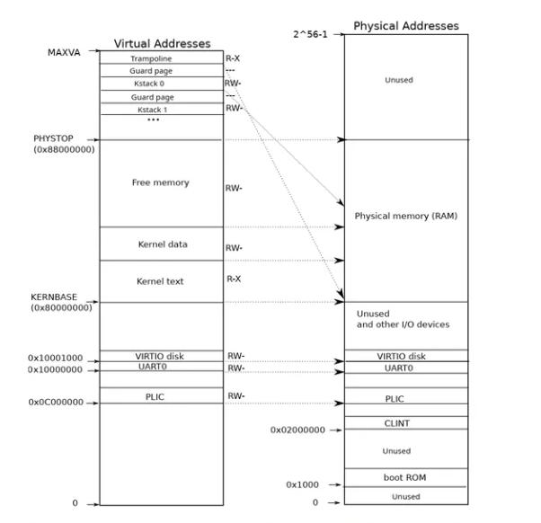
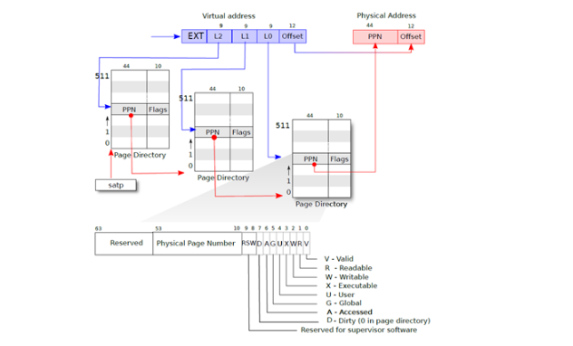

### 内存管理

#### 内核部分

**xv6内存结构**
首先我们来看一下xv6的映射

我们可以看到大部分位置都是使用的直接映射这是非常有意思的，我们可以在下面的代码分析中看到这一点。

我们可以看到有非常重要的两件事：
1.Guard page，GP这段内存是没有映射的，我们访问到之后可以直接产生缺页错误，这样避免了内存越界之后导致数据错误，因为缺页错误总比数据混乱要好

2.kernel stack被映射了两次，在靠后的虚拟地址映射了一次，在PHYSTOP下的Kernel data中又映射了一次，但是实际使用的时候用的是上面的部分，因为前后都有Guard page会更加安全。

**现代操作系统**
首先在现代操作系统中，分段和分页是同时存在的，但是操作系统屏蔽了段的存在，为了了解分段，很显然可以通过段寄存器（了解过汇编的应该清楚，在早期8086的远古时代，段寄存器是寻址时非常重要的寄存器）

那么操作系统时如何屏蔽的呢？其实很简单，在32位中，就是将整个程序看成一个段，但是在64位中，段寄存器就没用了也就是全是0。

可是当前操作系统真的舍弃掉段了吗？其实并不是，只不过由运行时系统维护了而已，也就是例如C++的代码区、常量区、静态和全局区、堆、栈


**xv6内存管理**
uvm开头的函数用来操纵用户态地址空间，kvm开头的函数用来操纵内核地址空间

当然和学的一样xv6主要也是使用虚拟内存管理的，必然是分页的    
对于内存的初始化时在main函数的最开始位置   


对于物理内存的管理在kalloc  
```C++
struct {   //kmem是用于管理物理页面的数据结构，就是一个链表。
  struct spinlock lock;  
  struct run *freelist;
} kmem;
 //最终达成的效果是：kmem本身是存放在内核的全局数据段里面，
 //然后它的freelist字段保存了第一个页面的物理地址
 //而第一个页面的物理地址的前8个字节又保存了第二个页面的物理地址……
 //想一下他用的是那种方式维护的空闲空间？
```

**kinit初始化物理内存链表**
kinit用来初始化所有物理内存
```C++
void
kinit()
{
   initlock(&kmem.lock, "kmem");  /* 初始化用于管理内存空闲块链表的自旋锁 */
   freerange(end, (void*)PHYSTOP); /* 将end至PHYSTOP 之间的内存页插入到空闲块链表中 */
} 
```

**kvminit创建内核页表**
```C++
/*
 * create adirect-map page table for the kernel.
 */
void
kvminit()
{
 kernel_pagetable = (pagetable_t) kalloc();     
 //kalloc申请一块物理页作为内核页表，将这个页表表现为根页表
 memset(kernel_pagetable, 0, PGSIZE);
 //将页表初始化，同时将页表清空
 
 //剩下的部分就是将所有需要的内存进行映射
  // uartregisters
 kvmmap(UART0, UART0, PGSIZE, PTE_R | PTE_W);  
 
  // virtiommio disk interface
 kvmmap(VIRTIO0, VIRTIO0, PGSIZE, PTE_R | PTE_W);
 
  // CLINT
 kvmmap(CLINT, CLINT, 0x10000, PTE_R | PTE_W);
 
  // PLIC
 kvmmap(PLIC, PLIC, 0x400000, PTE_R | PTE_W);
 
  // mapkernel text executable and read-only.
 kvmmap(KERNBASE, KERNBASE, (uint64)etext-KERNBASE, PTE_R | PTE_X);
 
  // mapkernel data and the physical RAM we'll make use of.
 kvmmap((uint64)etext, (uint64)etext, PHYSTOP-(uint64)etext, PTE_R |PTE_W);
 
  // map thetrampoline for trap entry/exit to
  // thehighest virtual address in the kernel.
 kvmmap(TRAMPOLINE, (uint64)trampoline, PGSIZE, PTE_R | PTE_X);
}
```


**地址映射**
接下来就可以看看kvmmap函数的实现了，据源码注释所述这个函数负责在内核页表中添加一个映射项，且此函数仅在启动时初始化内核页表时使用。它仅仅是mappages函数薄薄的一层封装与调用，使用时将内核页表指针传入mappages函数的第一项即可。
```C++
void
kvmmap(uint64 va, uint64 pa, uint64 sz, int perm)
{
 if(mappages(kernel_pagetable, va, sz, pa, perm) != 0)
   panic("kvmmap");
}
```
接下来就是地址映射的核心函数mappages，再看mappages之前需要一个页表计算函数


**PAGOUNDOWN和PAGOUNUP**
```C++
// PGROUNDUP(sz)：sz大小的内存至少使用多少页才可以存下，返回的是下一个未使用页的地址
// PGROUNDDOWN(a)：地址a所在页面是多少号页面，拉回所在页面开始地址
#define PGROUNDUP(sz)  (((sz)+PGSIZE-1) & ~(PGSIZE-1))
#define PGROUNDDOWN(a) (((a)) & ~(PGSIZE-1))
```

**mappages**
```C++
int
mappages(pagetable_t pagetable, uint64 va, uint64 size, uint64 pa, int perm)
{
  uint64 a,last;
  pte_t *pte;
 
  a =PGROUNDDOWN(va);
  last =PGROUNDDOWN(va + size - 1);  
  for(;;){
    if((pte =walk(pagetable, a, 1)) == 0)
      return-1;
    if(*pte& PTE_V)
     panic("remap");
    *pte =PA2PTE(pa) | perm | PTE_V;
    if(a ==last)
      break;
    a +=PGSIZE;
    pa +=PGSIZE;
  }
  return 0;
}
```

**walk查询页表**
在现代的计算机中，查询页表是硬件干的活。
为什么我们还需要walk函数呢？
1.XV6中的walk函数设置了最初的page table，它需要对3级page table进行设置所以它首先需要能模拟3级page table

2.内核有它自己的page table，用户进程也有自己的page table，用户进程指向sys_info结构体的指针存在于用户空间的page table，但是内核需要将这个指针翻译成一个自己可以读写的物理地址。如果你查看copy_in，copy_out，你可以发现内核会通过用户进程的page table，将用户的虚拟地址翻译得到物理地址，这样内核可以读写相应的物理内存地址，也就是在内核空间访问用户空间。
简单的来说，就是硬件只能将虚拟地址地址转化为自己的物理地址，但是内核在很多情况下需要访问其他用户进程的地址，所以我们walk函数。

首先我们需要注意的一个点xv6的每一页大小为4k，使用的是三级页表
27位划分为三级页表，12位寻址，注意这是虚拟地址的描述
对于物理地址RISC-V中，物理内存的地址为56位，其中44位是物理页号，剩下的12位是页内偏移      
所以我们只需要将虚拟地址的高27位翻译成物理地址的高44位


```C++
pte_t *
walk(pagetable_t pagetable, uint64 va, int alloc)
{
  if(va >= MAXVA)			// 如果虚拟地址超过了最大值，陷入错误
    panic("walk");
  
  // 模拟三级页表的查询过程，三级列表索引两次页表即可，最后一次直接组成物理地址
  for(int level = 2; level > 0; level--) {
  	// 索引到对应的PTE项
    pte_t *pte = &pagetable[PX(level, va)];
    // 确认一下索引到的PTE项是否有效(valid位是否为1)
    if(*pte & PTE_V) {
      // 如果有效接着进行下一层索引
      pagetable = (pagetable_t)PTE2PA(*pte);
      //这一条很有意思，PTE2PA是虚拟转物理，但是我们将一个物理给了一个应该是虚拟地址的东西，所以，其实对于内核页表来说物理和虚拟是相同的
    } else {
      // 如果无效(说明对应页表没有分配)
      // 则根据alloc标志位决定是否需要申请新的页表
      // < 注意，当且仅当低两级页表页(中间级、叶子级页表页)不存在且不需要分配时，walk函数会返回0 >
      // 所以我们可以通过返回值来确定walk函数失败的原因
      if(!alloc || (pagetable = (pde_t*)kalloc()) == 0)
        return 0;
      // 将申请的页表填满0
      memset(pagetable, 0, PGSIZE);
      // 将申请来的页表物理地址，转化为PTE并将有效位置1，记录在当前级页表
      // 这样在下一次访问时，就可以直接索引到这个页表项
      *pte = PA2PTE(pagetable) | PTE_V;
    }
  }
  return &pagetable[PX(0, va)];
}
```
**kalloc分配内存**
这是非常简单的，我们直接从链表中分配一块就可以。
```C++
void * kalloc(void)
{
  struct run*r;
 
  acquire(&kmem.lock);
  r =kmem.freelist;
  if(r)
    kmem.freelist = r->next;
  release(&kmem.lock);
 
  if(r)
    memset((char*)r, 5, PGSIZE); // fill with junk
  return(void*)r;
}
```

**kvminithart**
上面页表设置完毕了，应该启用页表了
```C++
void
kvminithart()
{
  w_satp(MAKE_SATP(kernel_pagetable));
  //首先我们可以看到kernel_pagetable来自kvminit的第一行，也就是我们分配好的页表的根。
  //执行完这一条下一条指令会发生什么呢，因为执行这条指令之前并没有使用页表，执行完这条指令之后，pc就增加了4，也就是pc+=4，修改之后使用了就是虚拟地址了，下一条指令位置就变了，可是为什么是正确的呢？
  //答案在前边已经提过一点了，那就是物理地址等于虚拟地址
  sfence_vma();
  //这一行主要是用来清空快表TLB缓存，复习一下TLB的作用和功能是什么？
}
```


